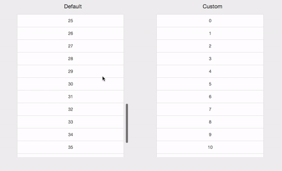

# React-Refresh-Infinite-TableView
___



### Features 👀

- Pull to Refresh
- Pull to Load More
- Fully Customizable Loading Indicator
- Subclass-able React Component

### How to Use 🤔?

```
import ReactRefreshInfiniteTableView from 'react-refresh-infinite-tableview'
```

- Use Default Spinners

  - subclass the ```ReactRefreshInfiniteTableView```
  ```
  class ExampleTableView extends ReactRefreshInfiniteTableView {
    //...
  }
  ```

 - attach an scroll event listener to your scrollview
 ```
 <div className="tableView" onScroll={this.viewDidScroll}>
 ```
 - set props to your tableview component
 ```
 <ExampleTableView
   dataSource={this.state.data}
   onScrollToTop={this.handleScrollToTop}
   onScrollToBottom={this.handleScrollToBottom}
 />
 ```
 - handle scroll events
 ```
 // handle onScrollToTop
 handleScrollToTop(completed) {
   // refresh data
   // ...

   // once received data
   completed()
   this.setState({data: newData})
 }
 // handle onScrollToBottom
 handleScrollToBottom(completed) {
   // load more data
   // ...

   // once received data
   completed()
   this.setState({data1: newData})
 }
 ```
 - see ExampleTableView1 for details

- Use your own loading indicators
  - first, you need to follow the basic set up as the above(use default spinner)
  - set useDefaultIndicator to false for your component
  ```
  useDefaultIndicator={false}
  ```
  - construct your own indicators with jsx
  ```
  // customize your Refresh Indicator here
  refreshIndicator() {
    if (this.state.isRefreshing) {
      return (
        <div className="list-group-item text-center indicator">🏃...</div>
      )
    }
    return
  }
  // customize your Load-more Indicator here
  loadMoreIndicator() {
    if (this.state.isLoadingMore) {
      return (
        <div className="list-group-item text-center indicator">...🏃</div>
      )
    }
    return
  }
  ```
  - render your indicators with your tableview
  ```
  <div className="tableView" onScroll={this.viewDidScroll}>
    {this.refreshIndicator()}
    {cells}
    {this.loadMoreIndicator()}
  </div>
  ```
  - see ExampleTableView2 for details

- You can also disable the scrollToTop or scrollToBottom by just by just not setting the props.
```
<ExampleTableView
  dataSource={this.state.data}
  onScrollToBottom={this.handleScrollToBottom}
/>
```

### Demo

- run the demo
```
npm install
npm start
```
